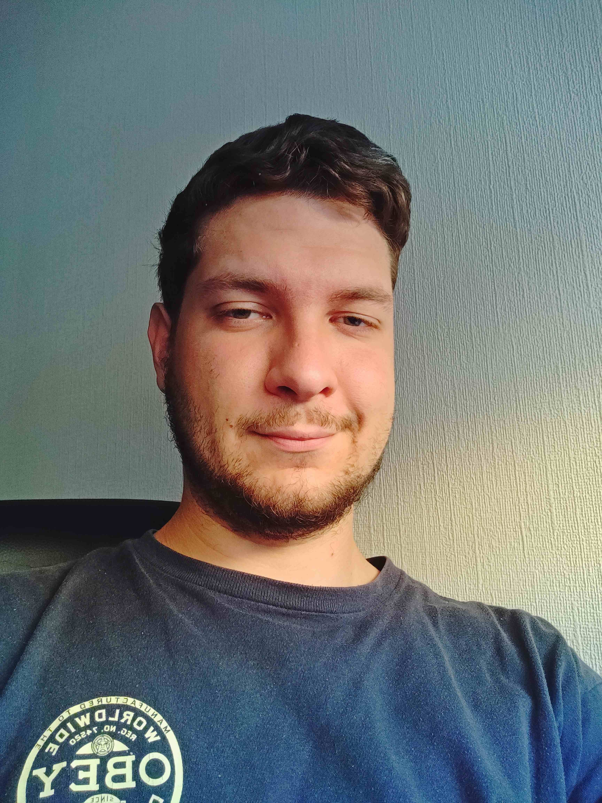

```{r setup, include=FALSE}
options(htmltools.dir.version = FALSE)
knitr::opts_chunk$set(
  fig.retina=2,
  out.width = "100%",
  cache = FALSE,
  echo = TRUE,
  message = FALSE, 
  warning = FALSE,
  hiline = TRUE
)

library(xaringan); library(fontawesome);
```

```{r xaringan-tile-view, echo=FALSE}
xaringanExtra::use_tile_view()
```

```{r xaringan-scribble, echo=FALSE}
xaringanExtra::use_scribble()
```

```{r xaringanExtra, echo = FALSE}
xaringanExtra::use_progress_bar(color = "#ff3355", location = "bottom")
```

```{r xaringan-themer, include=FALSE, warning=FALSE}
library(xaringanthemer)
style_duo_accent_inverse(
  primary_color = "#ff3355",
  secondary_color = "#b6c2ff",
  header_font_google = google_font("Cabin"),
  text_font_google = google_font("Noto Sans"),
  code_font_google = google_font("Source Code Pro"),
  text_font_size = "150%"
  )
```
.center[


[`r fa_i("paper-plane")` yacob.haddou@glasgow.ac.uk](mailto:yacob.haddou@glasgow.ac.uk)<br>
[`r fa_i("github")` @https://github.com/valiriel](https://github.com/valiriel)<br/>
[`r fa_i("orcid")` @https://orcid.org/0000-0003-0557-0339](https://orcid.org/0000-0003-0557-0339)<br/>
[`r fa_i("researchgate")` @https://www.researchgate.net/profile/Yacob-Haddou](https://www.researchgate.net/profile/Yacob-Haddou)<br/>
]

---

# How did I get here?

.large[
- **2015 - See you later Italy**
]

---

# How did I get here?

.large[
- 2015 - See you later Italy

- **2015 to 2018 - B.Sc. International Wildlife Biology @ USW**
]

---

# How did I get here?

.large[
- 2015 - See you later Italy

- 2015 to 2018 - B.Sc. International Wildlife Biology @ USW

- **2018 to 2019 - M.Sc. QMBCE @ University of Glasgow**
]

---

# How did I get here?

.large[
- 2015 - See you later Italy

- 2015 to 2018 - B.Sc. International Wildlife Biology @ USW

- 2018 to 2019 - M.Sc. QMBCE @ University of Glasgow

- **2019 to 2020 - Looking for PhD funding :(**
]

---

# How did I get here?

.large[
- 2015 - See you later Italy

- 2015 to 2018 - B.Sc. International Wildlife Biology @ USW

- 2018 to 2019 - M.Sc. QMBCE @ University of Glasgow

- 2019 to 2020 - Looking for PhD funding :(
  - **2019 to present - Graduate Teaching Assistant @ UoG Glasgow**
  - **2019 to 2020 - Research work in IBAHCM**
]

---

# How did I get here?

.large[
- 2015 - See you later Italy

- 2015 to 2018 - B.Sc. International Wildlife Biology @ USW

- 2018 to 2019 - M.Sc. QMBCE @ University of Glasgow

- 2019 to 2020 - Looking for PhD funding :(
  - 2019 to present - Graduate Teaching Assistant @ UoG Glasgow
  - 2019 to 2020 - Research work in IBAHCM

- **2020 to present - PhD via MVLS DTP Scholarship funding**

]

---

# How did I get here?

.large[

- 2018 to 2019 - M.Sc. QMBCE @ University of Glasgow

- 2019 to 2020 - Looking for PhD funding :(

- 2020 to present - PhD via MVLS DTP Scholarship funding
  - **Oct 2020 to Sept 2021 - project rotations**
  - **leave/extension to work on COVID-19 response for some months**
  - **Sept 2021 - start of main project**
]

---

# Some academic keywords about me

Biodiversity response to landscape changes

Extinction debts and colonization credits

R programming

Statistics + JAGS/STAN/INLA

Spatio-temporal analyses

GIS and r-spatial 

---

# Slides structure

.large[
1. Modelling COVID-19 incidence in Dhaka, Bangladesh

2. Intro to my PhD project
]

---

## Modelling COVID-19 incidence in Dhaka, Bangladesh

<font size="5">University of Glasgow COVID-19 LMIC modelling response team

.pull-left[
- <font size="5">Fergus J Chadwick @ UoG, IBAHCM</font>

- <font size="5">Yacob Haddou @ UoG, IBAHCM</font>

- <font size="5">Jess Clark @ UoG, IBAHCM</font>

- <font size="5">Jess Enright @ UoG, SCS</font>

- <font size="5">Elaine Ferguson @ UoG, IBAHCM</font>

- <font size="5">Katie Hampson @ UoG, IBAHCM</font>

- <font size="5">Davina Hill @ UoG, IBAHCM</font>
]

.pull-right[

- <font size="5">Jason Matthiopoulos @ UoG, IBAHCM</font> 

- <font size="5">Janine Illian @ UoG, SMS</font>

- <font size="5">Mikolaj E Kundegorski @ UoG, IBAHCM</font>

- <font size="5">Luca Nelli @ UoG, IBAHCM</font>

- <font size="5">Ben Swallow @ UoG, SMS</font>

- <font size="5">Craig Wilkie @ UoG, SMS</font>
]

------------

.center[
https://github.com/boydorr/BGD_Covid-19

https://github.com/valiriel/DHAKA_COVID19_INLA
]

---

## Modelling COVID-19 incidence in Dhaka, Bangladesh

# Why?

- Analyze the spatio-temporal trends of COVID-19 within one of the most densely populated megacities in the world

- Identify hotspots areas and worrying trends to inform the Bangladesh Institute of Epidemiology

- Feel useful during lockdown and provide statistical and data analysis help for on-the-ground interventions

- To learn Integrated Nested Laplace Approximation (INLA) modelling

---

## COVID-19 incidence across Dhaka

```{r, out.width='100%', echo=FALSE, warning=FALSE, eval=require('mapview')}
load("D:/GITHUB/DHAKA_COVID19_INLA/Dhaka_Data/Dhaka_Wards_SPATIAL.rda")
dhaka.wards <- dhaka.data
load("D:/GITHUB/DHAKA_COVID19_INLA/Dhaka_Data/Dhaka_Municipality_SPATIAL.rda")
dhaka.muni <- dhaka.data

m1 <- mapview::mapview(dhaka.wards, label="ID" , zcol="cases", alpha.regions = 0.8, map.types= c("CartoDB.Positron")) 

m2 <- mapview::mapview(dhaka.muni, label="ID" , zcol="cases", alpha.regions = 0.8, map.types= c("CartoDB.Positron"))

m1 + m2

```

---

## COVID-19 SIR across Dhaka 
Standardized Incidence Ratio (SIR) = observed cases / expected

```{r, out.width='100%', fig.height=5, echo=FALSE, warning=FALSE, eval=require('mapview')}
load("D:/GITHUB/DHAKA_COVID19_INLA/Dhaka_Data/Dhaka_Wards_SPATIAL.rda")
dhaka.wards <- dhaka.data
load("D:/GITHUB/DHAKA_COVID19_INLA/Dhaka_Data/Dhaka_Municipality_SPATIAL.rda")
dhaka.muni <- dhaka.data

m3 <- mapview::mapview(dhaka.wards, label="ID" , zcol="SIR", alpha.regions = 0.8, map.types= c("CartoDB.Positron"), col.regions = viridis::cividis(n=10)) 

m4 <- mapview::mapview(dhaka.muni, label="ID" , zcol="SIR", alpha.regions = 0.8, map.types= c("CartoDB.Positron"), col.regions = viridis::cividis(n=6))

m3 + m4

```

---

## COVID-19 temporal trends across Dhaka wards

```{r, fig.height=4, fig.width=9, echo=FALSE, warning=FALSE, eval=require('mapview')}
load("D:/GITHUB/DHAKA_COVID19_INLA/Dhaka_Data/Processed_DATA/Dhaka_Municipality_CASES.rda")
library(tidyverse)

ggplot() +
  geom_line(data=dhaka.cases, aes(x=date, y=cases), color="deeppink") + 
    facet_wrap(~ID) + theme_minimal()

```

---

## Modelling COVID-19 incidence in Dhaka, Bangladesh

# INLA

A little to complex to explain in 5 minutes. 

Imagine a linear model where you can define random effects, in INLA these random effects can be unstructured (your common glmer RE) or structured:

- **structured temporal RE** based on models such as ar1, rw, ar2

- **structured spatial RE** based for example on distance between polygons 

- **spatiotemporal interactions** of the options above

---

# I can't really show results time and non-disclosure agreements for now

---

## Modelling COVID-19 incidence in Dhaka, Bangladesh

# In the end it didn't even matter

#### Take home messages

- Sometime the data is not good enough for the model

- Data collection needs to follow scientific protocols, especially during a pandemic

- Testing capacity was not up to standards

- I guess, at least I learned how to use INLA...

---

# Back to biodiversity and the main PhD

- Started 2 weeks ago so much of is still unsure

- I am currently focusing on shaping up a clear set of research questions

- The overall topic will focus on returning to the analysis of biodiversity response to landscape changes

---

- Haddou Y., Mancy R., Matthiopoulos J., Spatharis S., Dominoni D. (2020) Invisible biodiversity: extinction debts and colonization credits amongst US birds. Nature Ecology and Evolution. [**in review**] [https://doi.org/10.21203/rs.3.rs-134174/v1] 

- Temporal lags in the response of biodiversity to changes in landscape composition
  - Compare taxa responses
  - Frequency of landscape changes and their speed
  - Incorporate more landscape components heterogeneity, climatic
  - Analyze differences across spatial and temporal, size at which these process manifest
  - Explore sensitivity of biodiversity metrics, functional diversity and niche occupancy

- Explore ecosystems engineering and biodiversity optimization.
  -Rearranging spatial features to achieve a target biodiversity.

---

## PhD supervisors

Davide Dominoni

Rebecca Mancy

Jason Matthioupoulos

Sofie Spatharis

## Funders
College of Medicine, Veterinary and Life Sciences @ University of Glasgow

---

## Thank you for the attention.

### Any questions ?

[`r fa_i("paper-plane")` yacob.haddou@glasgow.ac.uk](mailto:yacob.haddou@glasgow.ac.uk)<br>
[`r fa_i("github")` @https://github.com/valiriel](https://github.com/valiriel)<br/>
[`r fa_i("orcid")` @https://orcid.org/0000-0003-0557-0339](https://orcid.org/0000-0003-0557-0339)<br/>
[`r fa_i("researchgate")` @https://www.researchgate.net/profile/Yacob-Haddou](https://www.researchgate.net/profile/Yacob-Haddou)<br/>

slides powered by xaringan https://github.com/yihui/xaringan
