```{r setup, include=FALSE}
options(htmltools.dir.version = FALSE)
knitr::opts_chunk$set(
  fig.retina=2,
  out.width = "100%",
  cache = FALSE,
  echo = TRUE,
  message = FALSE, 
  warning = FALSE,
  hiline = TRUE,
  tidy=TRUE
)

library(xaringan); library(fontawesome); library(tidyverse)
```

```{r xaringan-tile-view, echo=FALSE}
xaringanExtra::use_tile_view()
```

```{r xaringan-scribble, echo=FALSE}
xaringanExtra::use_scribble()
```

```{r xaringanExtra, echo = FALSE}
xaringanExtra::use_progress_bar(color = "#1b9aaa", location = "bottom")
```

```{r xaringan-themer, include=FALSE, warning=FALSE}
library(xaringanthemer)
style_duo_accent_inverse(
  primary_color = "#ef476f",
  secondary_color = "#66cc99",
  text_color = "#ffffff",
  header_font_google = google_font("Quicksand"),
  text_font_google = google_font("Quicksand"),
  code_font_google = google_font("Fira Pro"),
  text_font_size = "150%"
  )
```
<br>
<font size="6"> __Main research theme__ : to understand and develop ways to quantify the delayed responses of organisms to environmental changes <font/>
<br>

2<sup>nd</sup> year PhD student in MVLS DTP

#####[`r fa_i("envelope")` yacob.haddou@glasgow.ac.uk](mailto:yacob.haddou@glasgow.ac.uk)

##### [`r fa_i("twitter")` yacob_haddou](https://twitter.com/yacob_haddou)

##### [`r fa_i("github")` `r fa_i("researchgate")` .../valiriel](https://github.com/valiriel)

<font size="5"> Slides coded with __markdown & xaringan__<font/>

---
<br>

<br>

<font size="7">

A __very__ simple example on how to infer a species-environment relationship and make predictions ( a.k.a __S__pecies __D__istribution __M__odels )

<font/>

---
<font size="8">1 <font/> <font size="6">- Do fieldwork or download some data on a species abundance (y) + source some variables of interest (x)
<font/>

.center[
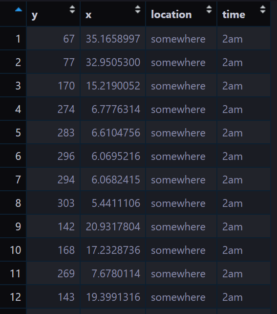
]

---
<font size="8">2 <font/> <font size="6">- Estimate the relationship between population & environment by fitting some form of glm-like approach  
<font/><font size="6">

<br>
<br>

$population  \sim\ f(environment)$
<br>

$y = mx + c$
<br>

---
<font size="8">3 <font/> <font size="6">- make inference and useful predictions from retrieved coefficients
<font/><font size="6">

.center[
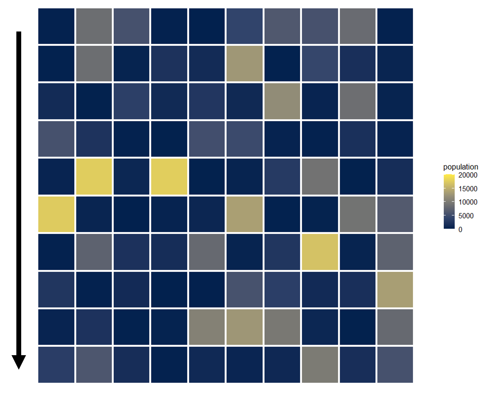
]
---
.center[
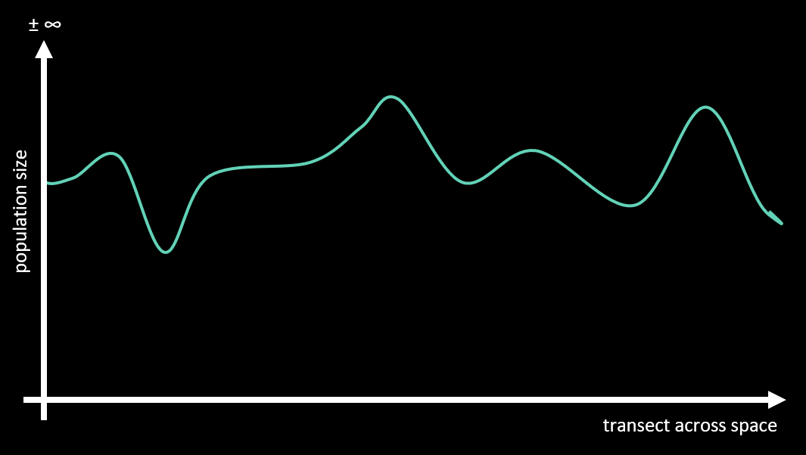
]
---
<br>

<br>

# PLOT TWIST
------------------------
<font size="7.5">
the predictions could instead be this if you sampled at another timepoint...

---

.center[
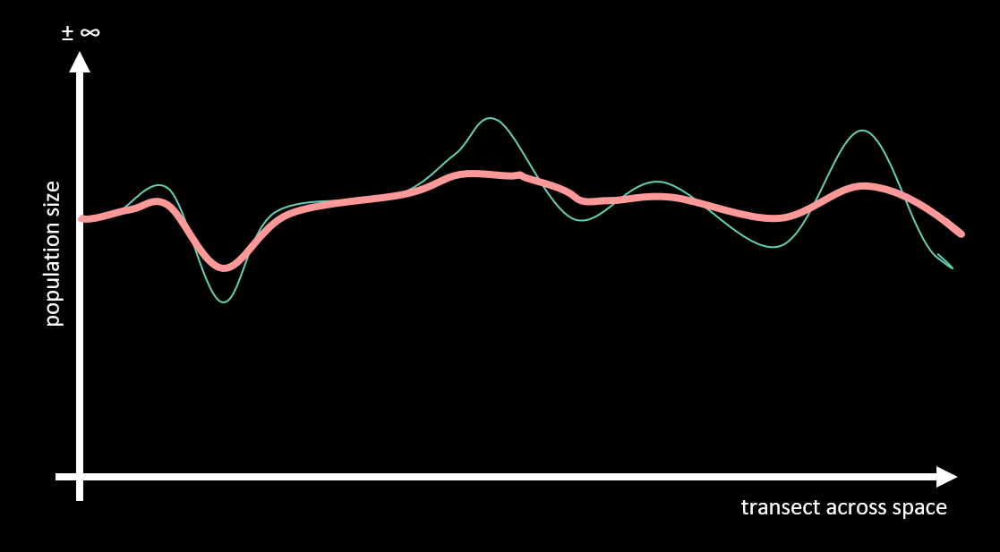
]

---

.center[
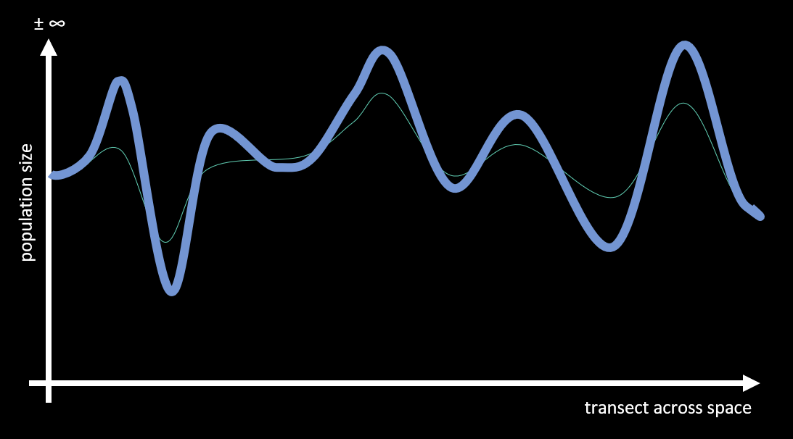
]
---

<!--- intro _ debts/credits/delays explanation --->

## why does this happen?
------------------------

Biotic responses to environmental change are often delayed through time.


---
<!--- intro _ debts/credits/delays explanation --->

## Background
------------------------

> Biotic responses to environmental change are often delayed through time.

<br>

Observed population and diversity metrics can be an __over/underestimation__ of the true capacity a landscape could support.

Imagine a population below or above carrying capacity. 

---
<!--- intro _ debts/credits/delays explanation --->

## Background
------------------------

> Biotic responses to environmental change are often delayed through time.

> Observed population and diversity metrics can be an over/underestimation of the true landscape capacity. 

<br>

Most predictive models of population dynamics and biodiversity do not control for this and __subconsciously make a pseudo-equilibrium assumption.__

---

<!--- explain medias res --->

<br><br/>
.left[#*In Medias Res*
]

To begin **a story** in the midst of of things. 

Making **a moment in the timeline** your **point of view,** 

whenever it occurs in the **chronology of events,** 

and to let it determine your **opinions on the matter.**</font>

---
<!--- explain medias res --->

<br><br/>
.left[#*In Medias Res*
]

To begin **an analysis** in the midst of things.

Making **an equilibrium assumption** on your **sampling event,** 

whenever it occurs in the **history of change,** 

and to let it determine your **inference & predictions.**

---
<!--- literal pun aside I am here to talk you about --->

<br><br/>

.right[## Environmental change inflates and shrinks the relationship between variables 
]

----
<b><font size="5"> Yacob Haddou, Sofie Spatharis, Rebecca Mancy, Davide Dominoni, Jason Matthiopoulos </font></b>

---
<!--- intro _ debts/credits/delays explanation --->

## Concept
------------------------

1. <p>Community at __equilibrium__ in a given landscape.
<br><br>

---
<!--- intro _ debts/credits/delays explanation --->

## Concept
------------------------

1. <p>Community at __equilibrium__ in a given landscape.
<br><br>

2. <p> A disturbance of the landscape takes place.
<br><br>

---
<!--- intro _ debts/credits/delays explanation --->

## Concept
------------------------

1. <p>Community at __equilibrium__ in a given landscape.
<br><br>

2. <p>A disturbance of the landscape takes place.
<br><br>

3. <p>Now you have a __"new"__ landscape inhabited by an __"old"__ community.
<br><br>

---
<!--- intro _ debts/credits/delays explanation --->

## Concept
------------------------

1. <p>Community at __equilibrium__ in a given landscape.
<br><br>

2. <p>A disturbance of the landscape takes place.
<br><br>

3. <p>Now you have a __"new"__ landscape inhabited by an __"old"__ community.
<br><br>

4. The community response is lagged and will require time to equilibriate.

---
## how did I get here?
------------------------

Previously understood how present biodiversity can be explained by a __mixture of past and present variables__ depending on the __magnitude, directionality and type__ of landscape change.
.center[
]

---

<!--- intro _ debts/credits/delays explanation --->

## <span style="color:#e71d36;font-size:110%">Extinction debts</span> and <span style="color:#1e90ff;font-size:110%">Colonisation credits</span>
------------------------

These delayed responses will manifest either as an:
<br><br>

<b><span style="color:crimson;font-size:170%">extinction debt</span></b> &nbsp;&nbsp;&nbsp; new equilibrium < current biodiversity
<br>

or

<b><span style="color:dodgerblue;font-size:170%">colonisation credit</span></b> &nbsp;&nbsp;&nbsp;  new equilibrium > current biodiversity

---

## Why worry?
------------------------

- Ignoring <b><span style="color:crimson;font-size:150%"> debts </span></b> makes us over-optimistic of conservation as well as oblivious of extinctions that are already present but not yet manifested in the landscape.

- Ignoring <b><span style="color:dodgerblue;font-size:150%"> credits </span></b> will lead to under-estimates of the current status and result in superfluous policies and efforts that could be better placed.

---
Predicted debts and credits in biodiversity across the whole contiguous USA

.center[
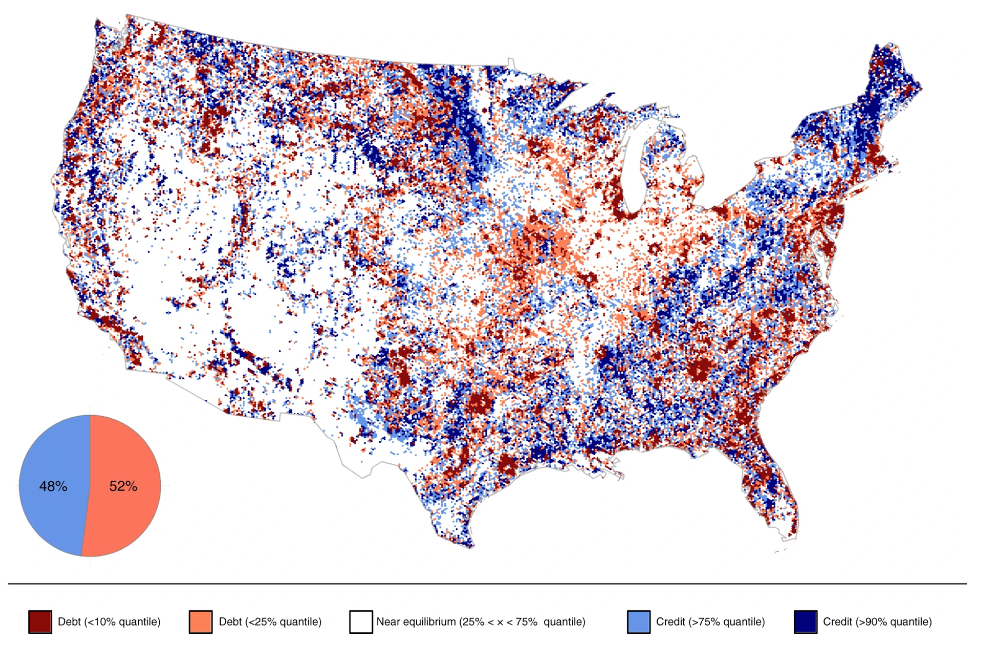]

---
.center[
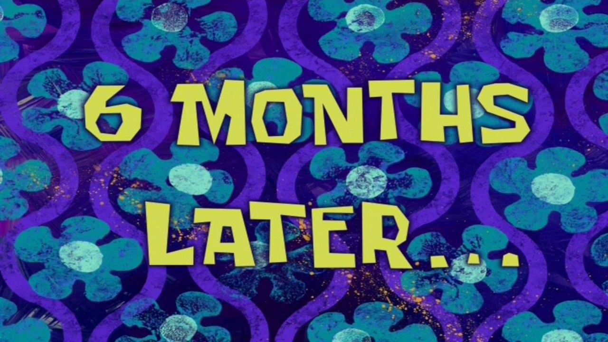]

Decided to read every methodology ever attempted in the field of ecological delays ...

---
<br><br><br>

> __No unified, agreed, applicable framework exists__

<br>
Let's work towards it

Exploring the process leading to delays in population dynamics through time instead of a broader biodiversity approach

---

We started thinking how these delays impact modelling, inference and predictions, in particular for:

__spatially bound Species Distribution Models__ and 
__temporally explicit population trajectories__.


---

<font size="4">
We started thinking how these delays impact modelling, inference and predictions, in particular for:

__spatially bound Species Distribution Models__ and __temporally explicit population trajectories__.

<font size="6"> 
<br>
## hypotheses ?
------------------------

Populations __<__ carrying capacity __=__ growing in time __=__ underestimate 

Populations __>__ carrying capacity __=__ decreasing __=__ overestimate 

---
## how do we prove this ?
------------------------

<b> 1. Source patterns of unidirectional change, for ___s___ locations and __t__ timepoints 

<br>

<font size="7"> 
x @ s,t

<br>

<font size="5"> 3 types of overall ___x___ patterns : upward, downward and stable

---
## how do we prove this ?
------------------------
<font size="4">
1. Source patterns of unidirectional change, for ___s___ locations and ___t___ timepoints 

<font size="6">
<b> 2. Play god and invent a species with a given relationship, ___β___, to ___x___ 

<br>

<font size="6">$$invented Species = f(x_{s,t};β)$$
<font size="6">$$β = invented Relationship$$

---
## how do we prove this ?
------------------------
<font size="4">
1. Source patterns of unidirectional change, for ___s___ locations and ___t___ timepoints 
2. Play god and invent a species with a given relationship, ___β___, to ___x___ 

<font size="6">
<b> 3. Calculate a carrying capacity, ___K___, for each __x__ (timepoint x location)

<br>
<font size="6">
$K_{s,t} = exp(f(x_{s,t};β)$

---
## how do we prove this ?
------------------------
<font size="4">
1. Source patterns of unidirectional change, for ___s___ locations and ___t___ timepoints 
2. Play god and invent a species with a given relationship, ___β___, to ___x___ 
3. Calculate a carrying capacity, ___K___, for each __x__ (timepoint x location)

<font size="6">
<b> 4. Set your initial population size, ___N___, to be = to ___K___ @ t=1

<font size="6"> $N_{s,t1} = K_{s,t1}$
<font size="5"> the system starts at equilibrium, attained carrying capacity, no past legacy from environmental disturbance

---
## how do we prove this ?
------------------------
<font size="4">
1. Source patterns of unidirectional change, for ___s___ locations and ___t___ timepoints 
2. Play god and invent a species with a given relationship, ___β___, to ___x___ 
3. Calculate a carrying capacity, ___K___, for each __x__ (timepoint x location)
4. Set your initial population size, ___N___, to be = to ___K___ @ t=1

<font size="6">
<b> 5. Run your population through the ___Ks___ via Ricker logistic function

<font size="6"> $N_{t+1} = N_{t} e^{r(K_t  - N_t )}$
<font size="5"> repeat this in parallel for a vector of potential response speeds, ___r___ and across your patterns of ___x___

---
## how do we prove this ?
------------------------
<font size="4">
1. Source patterns of unidirectional change, for ___s___ locations and ___t___ timepoints 
2. Play god and invent a species with a given relationship, ___β___, to ___x___ 
3. Calculate a carrying capacity, ___K___, for each __x__ (timepoint x location)
4. Set your initial population size, ___N___, to be = to ___K___ @ t=1
5. Run your population through the ___Ks___ via Ricker logistic function

<font size="6">
<b>6. Isolate and  model the final timepoint population size ___N___ and covariate ___x___ 

<font size="6"> $N_{s,t} \sim\ Poisson(f(x_{s,t};β))$
<font size="5"> separately for each pairwise grouping of __r__ and patterns of ___x___ 

---
## how do we prove this ?
------------------------
<font size="5">
1. Source patterns of unidirectional change, for ___s___ locations and ___t___ timepoints 
2. Play god and invent a species with a given relationship, ___β___, to ___x___ 
3. Calculate a carrying capacity, ___K___, for each __x__ (timepoint x location)
4. Set your initial population size, ___N___, to be = to ___K___ @ t=1
5. Run your population through the ___Ks___ via Ricker logistic function
6. Isolate and  model the final timepoint population size ___N___ and covariate ___x___

<font size="6">
<b> 7. Look at your coefficients and plot them out

---
.center[
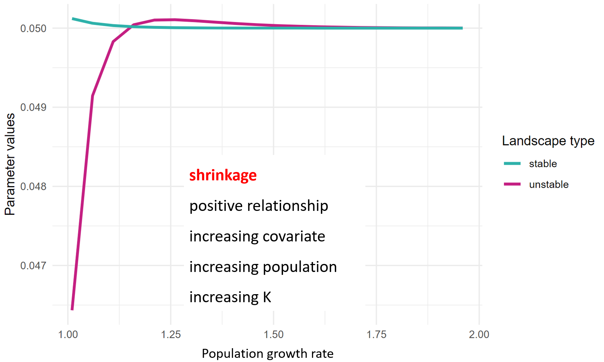
]
---
.center[

]
---
.center[
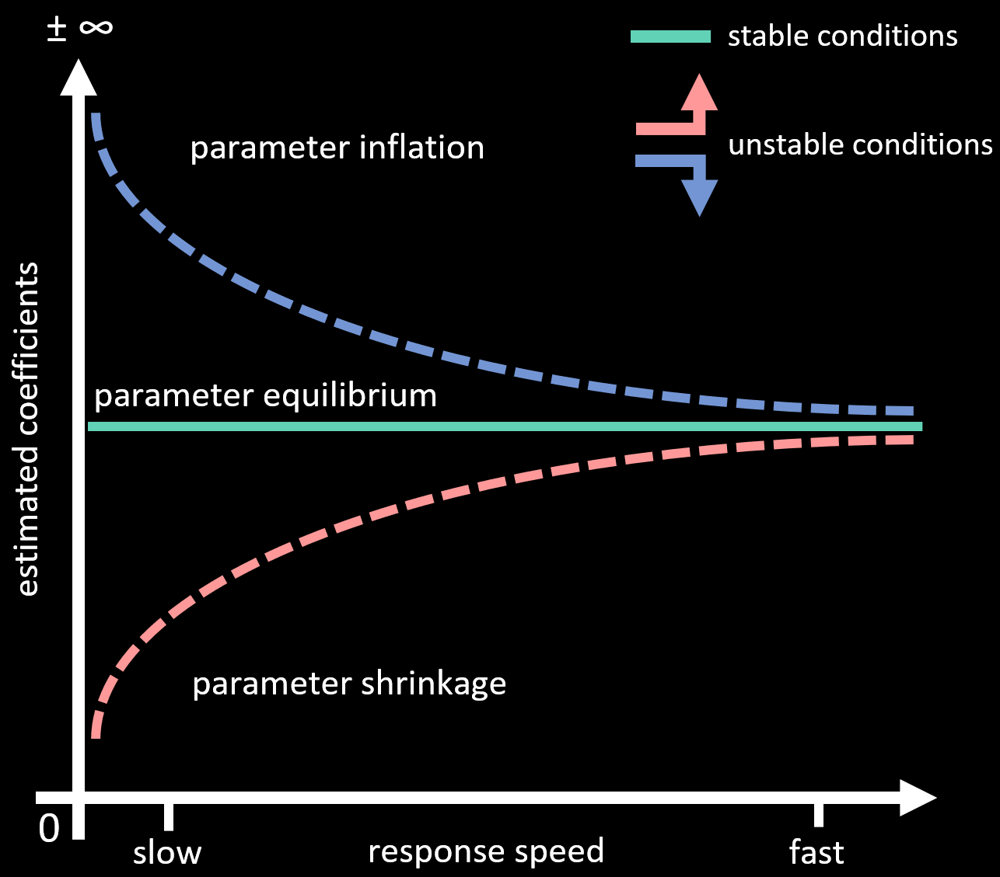
]
---
.center[
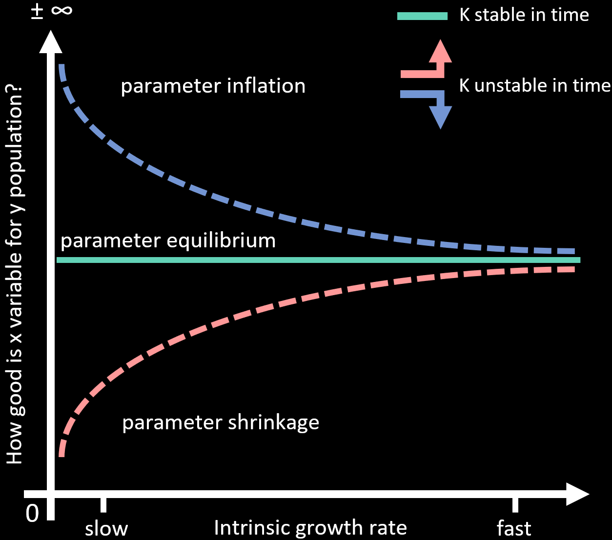
]

---

<br><br><br>
## Parameter deviation in space ?
------------------------
<br>
<b><font size="7">a 2D interpretation </font></b>

---
.center[

]

---

.center[
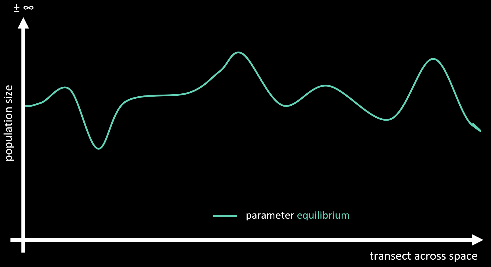
]

---

.center[
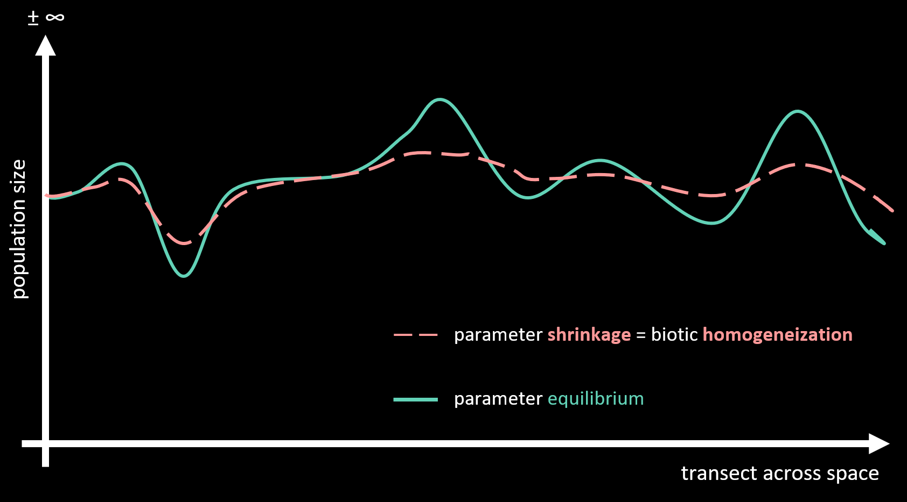
]

---

## <span style="color:#fc876a;font-size:110%"> Parameter shrinkage in space ?
---------------------------------

1. Species with increasing populations (K upward over time) 

2. Inference will underestimate relationship

3. Predictions will be more spatially homogeneous

<br>
Species will look more generalists and widespread while instead they should require targeted measures, 

highly relevant for invasive species control measures

---

.center[
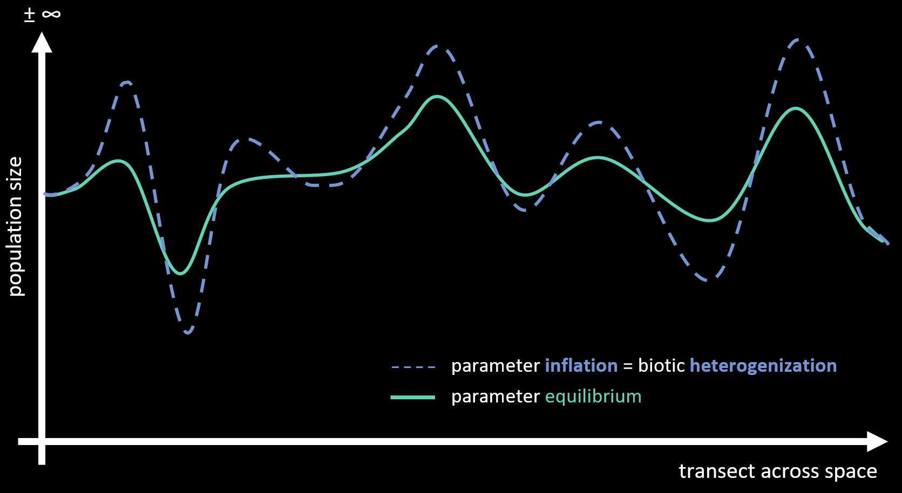
]

---

## <span style="color:#4fb1f2;font-size:110%"> Parameter inflation in space ?
---------------------------------

1. Species with decreasing populations (K downward over time) 

2. Inference will overestimate relationship

3. Predictions will be more spatially heterogeneous

<br>
Species will look to be relying on specific conservation hotspots while instead they could require a more spatially broad habitat protection

---

.center[
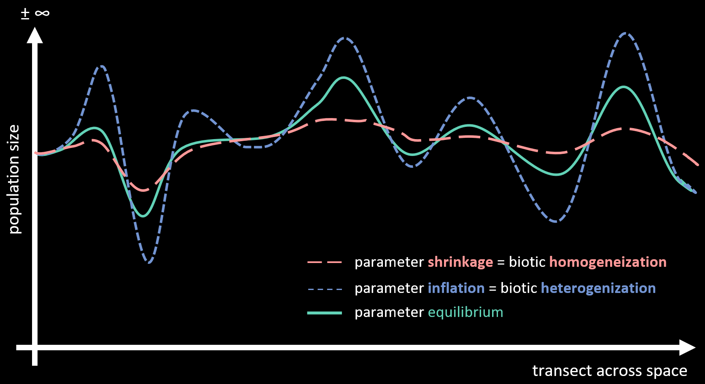
]

---

## Highlights
------------------------

- <b> Environmental change inflates or shrinks the inferred relationship between variables </b>

---

## Highlights
------------------------

> - Environmental change inflates or shrinks the inferred relationship between variables 

- <b> __Parameter deviation__ depends on response speed (intrinsic growth rate if talking about organisms) </b>


---

## Highlights
------------------------

> - Environmental change inflates or shrinks the inferred relationship between variables 

> - __Parameter deviation__ depends on response speed ( intrinsic growth rate if talking about organisms)

- <b> __Parameter shrinkage__, magnitude toward 0, happens in increasing populations

- <b> __<b>Parameter inflation__, magnitude toward infinite, happens in decreasing populations

---

## in development  .....

<br>
 - a case study show of the phenomena across continental scale and its implication for current policies 
 
 - defining an applicable law on how this works and ways to retrieve true parameter by knowing landscape history
 
 - viceversa on the above, if you know equilibrium and deviated parameters how long is your relaxation time, given nothing changes?
 
 - ..................

---
## Environmental change inflates and shrinks the relationship between variables 


<b><font size="6"> Yacob Haddou, Sofie Spatharis, Rebecca Mancy, Davide Dominoni, Jason Matthiopoulos </font></b>


#####[`r fa_i("envelope")` yacob.haddou@glasgow.ac.uk](mailto:yacob.haddou@glasgow.ac.uk)

##### [`r fa_i("twitter")` yacob_haddou](https://twitter.com/yacob_haddou)

##### [`r fa_i("github")` `r fa_i("researchgate")` .../valiriel](https://github.com/valiriel)

<font size="5"> Slides coded with __markdown & xaringan__<font/>

---

.center[

]

---

.center[

]

---

source("https://git.io/xaringan2pdf"); xaringan_to_pdf(input="parameter_deviation/parameter_deviation.html", output="parameter_deviation/parameter_deviation.pdf")
